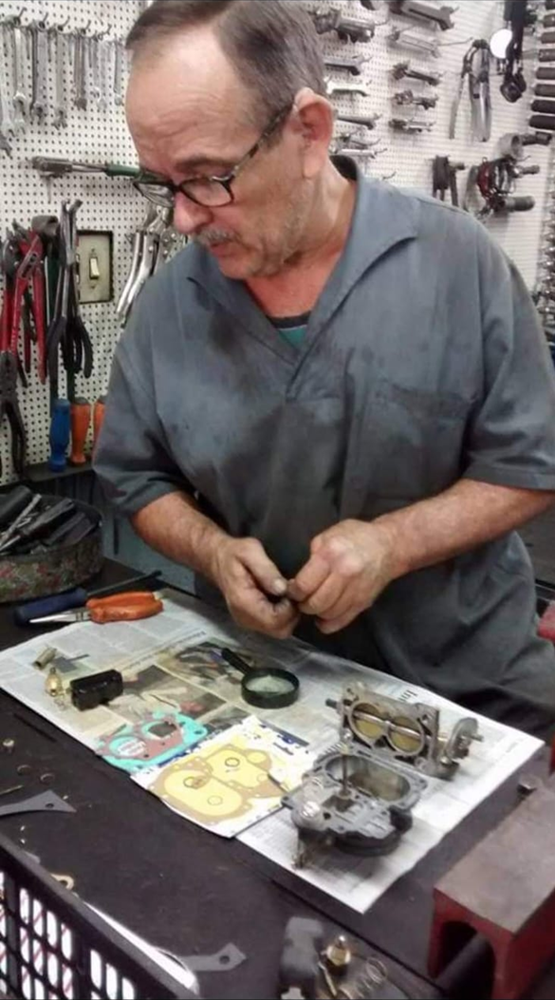
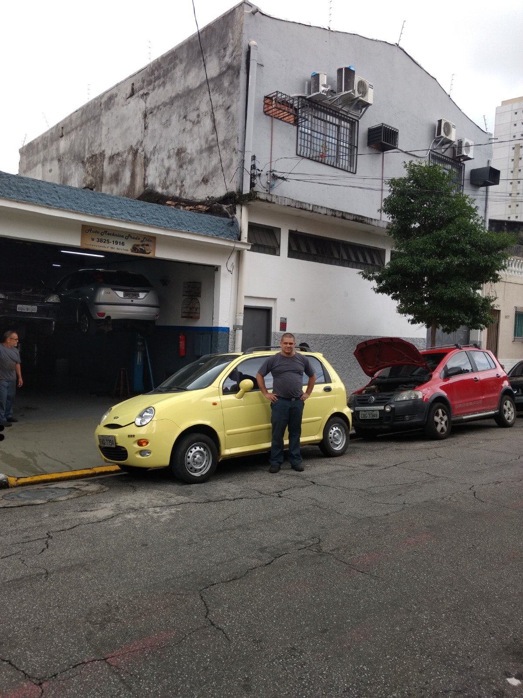
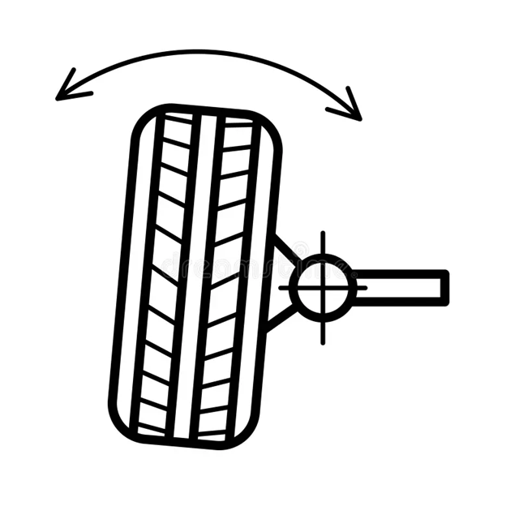
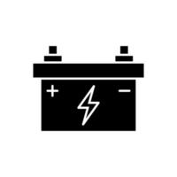
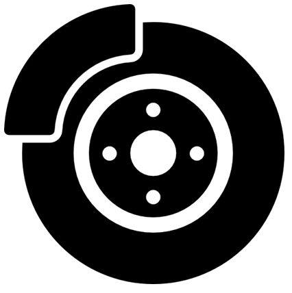
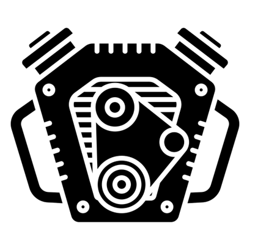
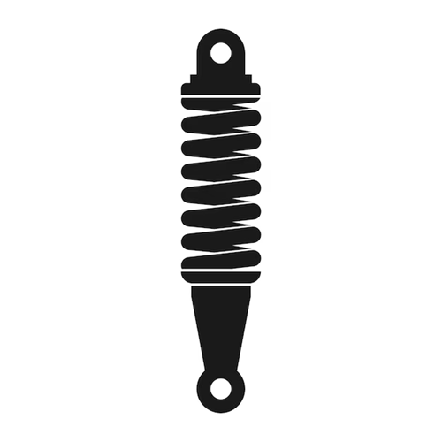

# Documentação do Site Institucional - Oficina Prado

## 1. Introdução

Este documento apresenta a especificação e detalhes do desenvolvimento do **site institucional** da **Oficina Prado**, uma oficina mecânica tradicional fundada em 1984. O site tem como objetivo apresentar a história da empresa, seus serviços, equipe e informações de contato para clientes e visitantes.

## 2. Escopo do Site

O site contempla as seguintes funcionalidades principais:

- Apresentação institucional da Oficina Prado.
- Exibição dos serviços oferecidos.
- Seção de contato com formulário integrado.
- Responsividade para dispositivos móveis.
- Possibilidade futura de integração com funcionalidades dinâmicas (agendamentos, área do cliente, etc).

## 3. Requisitos Funcionais.

- Exibir informações sobre a história e missão da empresa.
- Disponibilizar uma lista dos serviços prestados pela oficina.
- Permitir o envio de mensagens via formulário de contato.
- Apresentar localização e formas de contato.
- Ser acessível em dispositivos móveis e navegadores modernos.

## 4. Tecnologias Utilizadas.

- **HTML** – Estrutura do conteúdo do site.
- **CSS** – Estilização e responsividade do layout.
- **JavaScript** – Interatividade e funcionalidades dinâmicas no front-end.
- **PHP** – Processamento do formulário de contato e integração básica com o servidor.

## 5. Escopo do projeto para Site.

- Apresentar informações institucionais sobre a Oficina Prado e sua história.
- Exibir os principais serviços oferecidos pela oficina.
- Disponibilizar um formulário de contato para facilitar o atendimento ao cliente.
- Servir como base para futuras expansões, como agendamento online, área do cliente e orçamentos digitais.

## 5. Estrutura do Projeto.

- index.html - Página inicial
- sobre.html - Página "Sobre a Oficina"
- servicos.html - Página de serviços
- contato.html - Página de contato com formulário
- css/ - Arquivos de estilo CSS
- js/ - Scripts JavaScript
- php/ - Scripts PHP (ex: envio de e-mail)
- img/ - Imagens do site

# 6. Diagrama de Entidade-Relacionamento (DER)

```EED - Diagrama
+------------------+
|     contatos     |
+------------------+
| id (PK)          |
| nome             |
| email            |
| telefone         |
| mensagem         |
| data_envio       |
+------------------+
```


## 7. Códigos do Projeto

```EED - Diagrama do projeto web

+-------------+        1       N         +-------------+
|   Projeto   |-------------------------->|    Arquivo  |
+-------------+                           +-------------+
| id (PK)     |                           | id (PK)     |
| nome        |                           | projeto_id (FK) |
+-------------+                           | nome        |
                                          | tipo        |  -- (HTML, JS, PHP)
                                          | função      |  -- (INDEX, SOBRE, Serviços, Contato)
                                          +-------------+
```

## HTML

### 7.1 Arquivo HTML - INDEX

```html
<!DOCTYPE html>
<html lang="pt-br">
<head>
    <meta charset="UTF-8">
    <meta name="viewport" content="width=device-width, initial-scale=1.0">
    <link rel="stylesheet" href="styles.css">
    <title>Oficina</title>
</head>
<body>
    <header class="banner">
        <div class="logo-container">
            
        </div>
        <nav class="nav-container">
            <ul>
                <li><a href="Index.html">Home</a></li> 
                <li><a href="Sobre.html">Sobre</a></li>
                <li><a href="Serviços.html">Serviços</a></li>
                <li><a href="Contato.html">Contato</a></li>
            </ul>
        </nav>
    </header>

    <section class="main-content">
        
    </section>
    
    <footer class="footer">
        <div class="footer-item">
            <span>Horário de Funcionamento: 08:00 - 18:00</span>
        </div>
        <div class="footer-item">
            <span>Telefone: (11) 3825-1916</span>
        </div>
        <div class="footer-item">
            <span>Endereço: Rua Vitorino Carmilo, nº 1063 - Barra Funda - SP</span>
        </div>
    </footer>
</body>
</html>
```
### 7.2 Arquivo HTML - SOBRE
```HTML
<!DOCTYPE html>
<html lang="pt-br">
<head>
    <meta charset="UTF-8">
    <meta name="viewport" content="width=device-width, initial-scale=1.0">
    <title>Sobre Nós</title>
    <link rel="stylesheet" href="styles.css">
</head>
<body>
    <header class="banner">
        <div class="logo-container">
            
        </div>
        <nav class="nav-container">
            <ul>
                <li><a href="Index.html">Home</a></li> 
                <li><a href="Sobre.html">Sobre</a></li>
                <li><a href="Serviços.html">Serviços</a></li>
                <li><a href="Contato.html">Contato</a></li>
            </ul>
        </nav>
    </header>
    <main class="sobre-container">
        <div class="texto">
            <h1>Sobre a Oficina</h1>
            <br>
            <p>
                <strong>Fundada em 1984</strong>, a Auto Mecânica Prado é a continuidade de um legado iniciado pelo 
                Sr. José Prado Bortolotto, que dedicou sua vida à manutenção automotiva. Trabalhando lado a lado 
                com seu filho e neto, ele transmitiu seu conhecimento e paixão pela mecânica, formando gerações 
                de profissionais qualificados.
            </p>
            <br>
            <p>
                A próxima geração de comando da Auto Mecânica Prado ficou por conta de José Américo e seus filhos. 
                Dos netos de José Prado, no comando da terceira geração, estão <strong>Marcelo e Tiago</strong>. 
            </p>
                
            <br>

            <p> Marcelo, como técnico em automobilística, cuida da parte técnica, enquanto Tiago, como gestor administrativo, 
                cuida da gestão. Ambos se ajudam em todas as funções, carregando o legado de geração em geração 
                e prestando serviços de qualidade.
            </p>
            <br>    
            <p>
                Atualmente, a oficina é comandada pelos netos de José Prado, representando a terceira geração 
                da família no ramo. <strong>Localizada no bairro da Barra Funda desde 1984</strong>, a oficina 
                mantém sua tradição de qualidade e confiança no atendimento.
            </p>
        </div>
        <div class="imagens">
            <strong>José Américo</strong></p>
            
        </div>
    </main>

    <section class="link-container">
        <h1>Reportagem</h1>
        <p>Como Vencer os Estereótipos que Afetam a Profissão de Mecânico. A profissão de mecânico enfrenta diversos estereótipos. <a href="https://omecanico.com.br/como-vencer-os-estereotipos-que-afetam-a-profissao-de-mecanico/" target="_blank">Leia mais sobre como vencer esses estereótipos neste artigo.</a>
        </p>
    </section>

    <section class="video-container">
        <h2>Programa Raio-X</h2>
        <br>
        <div class="video">
            <iframe src="https://www.youtube.com/embed/TPmEwzJuQNQ" 
        frameborder="0" 
        allow="accelerometer; autoplay; encrypted-media; gyroscope; picture-in-picture" 
        allowfullscreen 
        width="100%" height="650">
</iframe>
        </div>
        <p class="final-texto">
            O Marcelo participou do programa <strong>Raio-X da Revista O Mecânico</strong>, onde apresentou o <strong>Fiat Toro Ultra</strong>. 
            
        </p>
    </section>

    <footer class="footer">
        <div class="footer-item">
            <span>Horário de Funcionamento: 08:00 - 18:00</span>
        </div>
        <div class="footer-item">
            <span>Telefone: (11) 3825-1916</span>
        </div>
        <div class="footer-item">
            <span>Endereço: Rua Vitorino Carmilo, nº 1063 - Barra Funda - SP</span>
        </div>
</body>
</html>


```

### 7.3 Arquivo HTML - Serviços
```HTML
<!DOCTYPE html>
<html lang="pt-br">
<head>
    <meta charset="UTF-8">
    <meta name="viewport" content="width=device-width, initial-scale=1.0">
    <title>Serviços</title>
    <link rel="stylesheet" href="styles.css">
</head>
<body>
    <header class="banner">
        <div class="logo-container">
            
        </div>
        <nav class="nav-container">
            <ul>
                <li><a href="Index.html">Home</a></li> 
                <li><a href="Sobre.html">Sobre</a></li>
                <li><a href="Serviços.html">Serviços</a></li>
                <li><a href="Contato.html">Contato</a></li>
            </ul>
        </nav>
    </header>

    <main class="servicos-container">
        <div class="servicos-content">
            <div class="conteudo-flex">
                <section style="text-align: justify;">
                    <h1>Manutenção Completa para o Seu Veículo</h1>
                                             
                <div class="imagem-centralizada">
                    
                    
                </div>
            </div>
    
            <div class="imagens-servicos">
                <div class="servico-item">
                    
                    <p class="imagem-nome"><strong>Alinhamento</strong></p>
                </div>
                <div class="servico-item">
                    
                    <p class="imagem-nome"><strong>Bateria</strong></p>
                </div>
                <div class="servico-item">
                    
                    <p class="imagem-nome"><strong>Freio</strong></p>
                </div>
                <div class="servico-item">
                    
                    <p class="imagem-nome"><strong>Motor</strong></p>
                </div>
                <div class="servico-item">
                    
                    <p class="imagem-nome"><strong>Óleo</strong></p>
                </div>
                <div class="servico-item">
                    
                    <p class="imagem-nome"><strong>Suspensão</strong></p>
                </div>
            </div>
        </div>
    </main>
    <footer class="footer">
        <div class="footer-item">
            <span>Horário de Funcionamento: 08:00 - 18:00</span>
        </div>
        <div class="footer-item">
            <span>Telefone: (11) 3825-1916</span>
        </div>
        <div class="footer-item">
            <span>Endereço: Rua Vitorino Carmilo, nº 1063 - Barra Funda - SP</span>
        </div>
</body>
</html>    
```

### 7.4 Arquivo HTML - Contato
```HTML
<!DOCTYPE html>
<html lang="pt-br">
<head>
    <meta charset="UTF-8">
    <meta name="viewport" content="width=device-width, initial-scale=1.0">
    <title>Contato</title>
    <link rel="stylesheet" href="styles.css">
</head>
<body>
    <header class="banner">
        <div class="logo-container">
            
        </div>
        <nav class="nav-container">
            <ul>
                <li><a href="Index.html">Home</a></li> 
                <li><a href="Sobre.html">Sobre</a></li>
                <li><a href="Serviços.html">Serviços</a></li>
                <li><a href="Contato.html">Contato</a></li>
            </ul>
        </nav>
    </header>
    
    <main class="contato-container">
        <div class="texto-contato">
            <h1>Contato</h1>
            <p>Estamos à disposição para qualquer dúvida! Você pode entrar em contato conosco e também enviar o seu orçamento pelo formulário online, WhatsApp ou e-mail. Fique à vontade para escolher o meio que for mais conveniente para você!</p>
        </div>

        <div class="contato-meios">
            <div class="meio">
                
                <p><strong>WhatsApp</strong></p>
            </div>
            <div class="meio">
                
                <p><strong>E-mail</strong></p>
            </div>
        </div>
    </main>

    <section class="form-orcamento">
        <h2>Solicite um Orçamento</h2>
        <form id="form-contato">
            <label for="nome" class="label-align">Nome:</label>
            <input type="text" id="nome" name="nome" required>
            
            <label for="email" class="label-align">E-mail:</label>
            <input type="email" id="email" name="email" required>
    
            <label for="telefone" class="label-align">Telefone:</label>
            <input type="text" id="telefone" name="telefone" required>
    
            <label for="mensagem" class="label-align">Detalhes da Solicitação:</label>
            <textarea id="mensagem" name="mensagem" rows="4" placeholder="Digite seu texto aqui..." required></textarea>
    
            <button type="submit">Enviar Orçamento</button>
        </form>

        
        <p id="mensagem-envio"></p>
    </section>
    
    <style>
        .label-align {
            display: block; 
            margin-bottom: 5px; 
            text-align: left; 
        }

        #mensagem-envio {
            margin-top: 10px;
            font-weight: bold;
            transition: opacity 0.5s ease;
        }
    </style>

    <footer class="footer">
        <div class="footer-item">
            <span>Horário de Funcionamento: 08:00 - 18:00</span>
        </div>
        <div class="footer-item">
            <span>Telefone: (11) 3825-1916</span>
        </div>
        <div class="footer-item">
            <span>Endereço: Rua Vitorino Carmilo, nº 1063 - Barra Funda - SP</span>
        </div>
```
## CSS

### 7.5 Arquivo HTML - SOBRE
```CSS
* {
    margin: 0;
    padding: 0;
    box-sizing: border-box;
}

body {
    font-family: Arial, sans-serif;
    background-color: #d9d3d3; 
}


.banner {
    display: flex;
    justify-content: space-between; 
    align-items: center;
    background-color: black;
    color: white;
    padding: 15px 30px;
    position: fixed;
    top: 0;
    width: 100%;
    z-index: 1000; 
}

.logo-container {
    flex: 0 1 auto; 
}

.logo {
    max-width: 100%; 
    height: auto;
}

.nav-container ul {
    list-style-type: none;
    display: flex;
    margin: 0;
    padding: 0;
}

.nav-container ul li {
    margin: 15px;
    font-size: 18px; 
}


.main-content {
    margin-top: 25px; 
    display: flex;
    justify-content: center;
    align-items: center;
    height: 100%; 
}

.banner-image {
    max-width: 100%;
    height: auto;
    object-fit: cover; 
}

.footer {
    display: flex;
    justify-content: space-between;
    align-items: center;
    background-color: black;
    color: white;
    padding: 15px 30px;
    position: relative;
    bottom: 0;
    width: 100%;
    z-index: 1000; 
}

.footer-item {
    flex: 1;
    text-align: center;
}

.footer-item span {
    font-size: 17px; 
}

.footer-item:first-child {
    text-align: left;
}

.footer-item:last-child {
    text-align: right;
}


.sobre-container {
    display: flex;
    align-items: flex-start; 
    justify-content: space-between; 
    gap: 30px; 
    max-width: 1200px; 
    margin: 0 auto; 
    padding: 100px 40px; 
}

.texto {
    flex: 2; 
    text-align: justify; 
    font-size: 20px; 
    line-height: 1.8; 
}

.imagens {
    flex: 1; 
    display: flex;
    flex-direction: column; 
    gap: 20px; 
    justify-content: flex-start; 
    align-items: flex-end; 
}

.sobre-img {
    width: 100%; 
    max-width: 400px; 
    height: auto; 
    border-radius: 8px; 
}

header.banner {
    margin-bottom: 40px; 
}


body {
    text-align: center;
    font-family: Arial, sans-serif;
}


.texto {
    margin: 0 auto;
    padding: 150px;
    max-width: 1000px; 
}


body {
    font-family: Arial, sans-serif;
    text-align: center;
}

h1, h2 {
    font-weight: bold;
}

h2 {
    text-align: left;
    margin-top: 20px;
    font-size: 48px; 
}

.sobre-container {
    max-width: 1400px;
    margin: 0 auto;
    padding: 30px;
}

.texto p {
    font-size: 25px; 
    margin-bottom: 10px;
    line-height: 1.8;
}

.imagens {
    display: flex;
    justify-content: center;
    gap: 20px;
    margin-top: 160px;
}

.sobre-img {
    width: 375px; 
    height: auto;
    border-radius: 9px;
}


.link-container {
    background-color: #f4f4f4; 
    padding: 20px; 
    border-radius: 8px; 
    max-width: 900px; 
    margin: 40px auto; 
    box-shadow: 0 2px 8px rgba(0, 0, 0, 0.1); 
}


.link-container h1 {
    font-size: 28px; 
    color: #333; 
    font-weight: bold;
    margin-bottom: 15px; 
    text-align: left; 
}


.link-container p {
    font-size: 18px; 
    line-height: 1.6; 
    color: #555; 
    text-align: left; 
    margin-bottom: 20px; 
}


.link-container a {
    color: #1e90ff; 
    text-decoration: none; 
    font-weight: bold; 
}

.link-container a:hover {
    color: #0056b3; 
    text-decoration: underline; 
}


video-container {
    text-align: center; 
    margin: 10px auto; 
    max-width: 1200px; 
    padding: 10px; 
}


.video-container h2 {
    text-align: left; 
    font-size: 24px;
    color: black; 
    margin-bottom: 15px;
}

.video iframe {
    width: 100%; 
    height: 750px; 
    max-width: 100%;
    border: none; 
    display: block; 
    margin: 0 auto; 
}

.final-texto {
    font-size: 25px; 
    color: #060505; 
    line-height: 1.6; 
    text-align: justify; 
    margin-top: 10px; 
}

.video-container {
    margin-top: 10px; 
}


.servicos-container {
    margin: 6%;
    padding: 3%;
}


body {
    font-family: Arial, sans-serif;
    margin: 0;
    padding: 0;
    background-color: #f4f4f4;
}


.banner {
    background-color: #000;
    color: #fff;
    padding: 10px 0;
    display: flex;
    justify-content: space-between;
    align-items: center;
}

.logo-container img {
    width: 100%;
    max-width: 400px;
}

.nav-container ul {
    list-style: none;
    display: flex;
    margin: 0;
    padding: 0;
}

.nav-container ul li {
    margin-left: 20px;
}

.nav-container ul li a {
    color: white;
    text-decoration: none;
    font-size: 18px;
    font-weight: bold;
}

.nav-container ul li a:hover {
    text-decoration: underline;
}


.servicos-container {
    margin: 5%;
    padding: 3%;
    background-color: white;
    border-radius: 10px;
}

.conteudo-flex {
    display: flex;
    flex-wrap: wrap;
    justify-content: space-between;
    gap: 20px;
}

h1 {
    font-size: 40px;
    font-weight: bold;
    margin-bottom: 20px;
}


.imagem-centralizada {
    display: flex;
    gap: 20px;
}

.img-centralizada {
    width: 48%;
    border-radius: 10px;
    object-fit: cover;
}


.imagens-servicos {
    display: flex;
    flex-wrap: wrap;
    justify-content: space-between;
    margin-top: 30px;
}

.servico-item {
    text-align: center;
    width: 30%;
    margin-bottom: 20px;
}

.servico-img {
    width: 100%;
    max-width: 170px;
    height: auto;
    border-radius: 15px;
}

.imagem-nome {
    font-size: 20px;
    font-weight: bold;
    margin-top: 5px;
}


.footer {
    background-color: #333;
    color: white;
    padding: 20px 0;
    display: flex;
    justify-content: space-around;
    font-size: 14px;
}

.footer-item {
    flex: 1;
    text-align: center;
}

.footer-item span {
    display: block;
}


.sobre-container {
    margin: 20px;
}


.imagens {
    display: flex;
    justify-content: space-between;
    margin-bottom: 30px;
}

.imagem-container {
    flex: 1;
    text-align: center;
}

.sobre-img {
    width: 100%;
    max-width: 500px; 
    height: auto;
    margin-bottom: 10px;
}


.sobre-container {
    margin: 20px;
}


.imagens {
    display: flex;
    justify-content: space-between;
    margin-bottom: 30px;
}

.imagem-container {
    flex: 1;
    text-align: center;
}

.sobre-img {
    width: 100%;
    max-width: 500px; 
    height: auto;
    margin-bottom: 10px;
}


.contato-container {
    width: 80%;
    margin: 0 auto;
    text-align: left;
}


.texto-contato {
    margin-top: 150px;
}

.texto-contato h1 {
    font-size: 35px;
    color: black;
}

.texto-contato p {
    font-size: 28px;
    color: black;
    max-width: 900px;
    margin: 0 auto;
}


.contato-meios {
    display: flex;
    justify-content: center;
    gap: 180px;
    margin-top: 20px;
}

.meio {
    text-align: center;
}

.meio img {
    width: 80px;
    height: 80px;
}

.meio p {
    font-size: 16px;
    font-weight: bold;
    margin-top: 10px;
}


.form-orcamento {
    margin-top: 40px;
    max-width: 590px;
    margin-left: auto;
    margin-right: auto;
    padding: 20px;
    background-color: #f9f9f9;
    border-radius: 8px;
    box-shadow: 0px 4px 6px rgba(0, 0, 0, 0.1);
}


.form-orcamento form {
    display: flex;
    flex-direction: column;
}


.form-orcamento label {
    margin-top: 10px;
    font-size: 19px;
}


.form-orcamento input {
    padding: 10px;
    margin-top: 10px;
    font-size: 16px;
    border: 1px solid #ddd;
    border-radius: 5px;
    width: 100%;
}


.form-orcamento button {
    margin-top: 20px;
    padding: 12px;
    background-color: #0044cc;
    color: white;
    border: none;
    cursor: pointer;
    font-size: 16px;
    border-radius: 5px;
}

.form-orcamento button:hover {
    background-color: #0033a0;
}


## JS

### 7.6 Arquivo HTML - SOBRE
```JS
document.addEventListener('DOMContentLoaded', () => {
  const form = document.getElementById('form-contato');
  const msg = document.getElementById('mensagem-envio');

  form.addEventListener('submit', function (e) {
    e.preventDefault();

    const nome = document.getElementById('nome').value.trim();
    const email = document.getElementById('email').value.trim();
    const telefone = document.getElementById('telefone').value.trim();
    const mensagem = document.getElementById('mensagem').value.trim();

    if (!nome || !email || !telefone || !mensagem) {
      msg.textContent = 'Por favor, preencha todos os campos.';
      msg.style.color = 'red';
      msg.style.opacity = '1';
      setTimeout(() => {
        msg.style.opacity = '0';
      }, 4000);
      return;
    }

    const formData = new FormData(form);

    fetch('salvar_contato.php', {
      method: 'POST',
      body: formData
    })
    .then(res => res.text())
    .then(response => {
      msg.textContent = 'Orçamento enviado com sucesso! Entraremos em contato.';
      msg.style.color = 'green';
      form.reset();
    })
    .catch(error => {
      msg.textContent = 'Erro ao enviar. Tente novamente.';
      msg.style.color = 'red';
    })
    .finally(() => {
      msg.style.opacity = '1';
      setTimeout(() => {
        msg.style.opacity = '0';
      }, 4000);
    });
  });
});

```

## PHP

### 7.6 Arquivo PHP - Salvar_contato
```PHP
<?php
include("conexao.php");

$nome = $_POST['nome'];
$email = $_POST['email'];
$telefone = $_POST['telefone'];
$mensagem = $_POST['mensagem'];

$sql = "INSERT INTO contatos (nome, email, telefone, mensagem)
        VALUES ('$nome', '$email', '$telefone', '$mensagem')";

if ($conn->query($sql) === TRUE) {
    echo "Mensagem enviada com sucesso!";
} else {
    echo "Erro: " . $sql . "<br>" . $conn->error;
}

$conn->close();
?>

```
### 7.7 Arquivo PHP - conexao_php
```PHP
<?php
$host = "localhost";
$usuario = "root";
$senha = "";
$banco = "mecanica_prado";

$conn = new mysqli($host, $usuario, $senha, $banco);

if ($conn->connect_error) {
    die("Erro na conexão: " . $conn->connect_error);
}
?>

```
### 7.B Código - SQL
```SQL
CREATE TABLE contatos (
    id INT AUTO_INCREMENT PRIMARY KEY,
    nome VARCHAR(255) NOT NULL,
    email VARCHAR(255) NOT NULL,
    telefone VARCHAR(50) NOT NULL,
    mensagem TEXT NOT NULL,
    data_envio TIMESTAMP DEFAULT CURRENT_TIMESTAMP
);

INSERT INTO contatos (nome, email, telefone, mensagem)
VALUES (
    'Anderson Alves',
    'andersol_a83@gmail.com',
    '(11) 98274-5698',
    'Gostaria de saber mais sobre os serviços oferecidos.'
);```SQL

```
7.9 Estrutura do Programa dentro da IDE MySQL Workbench.


7.10 Visualização do EER Driagrama do Bando de Dados Odicina.


